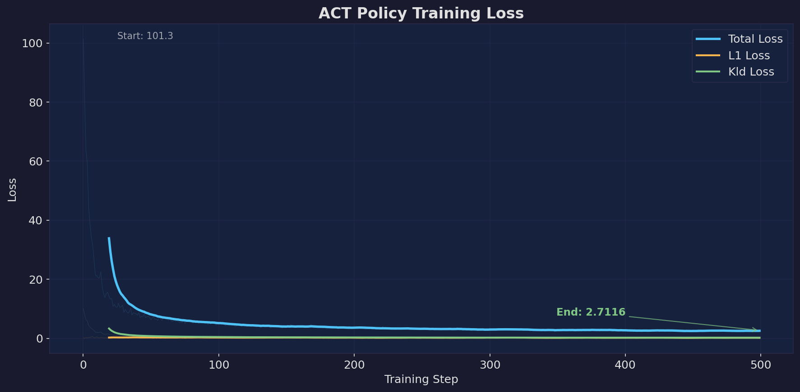
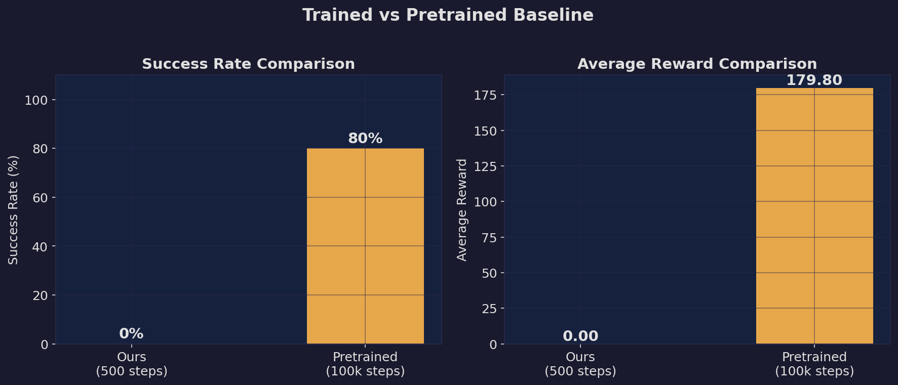
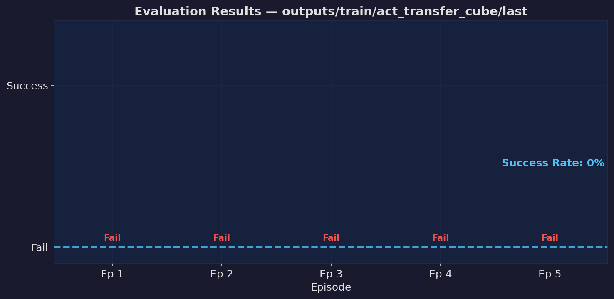
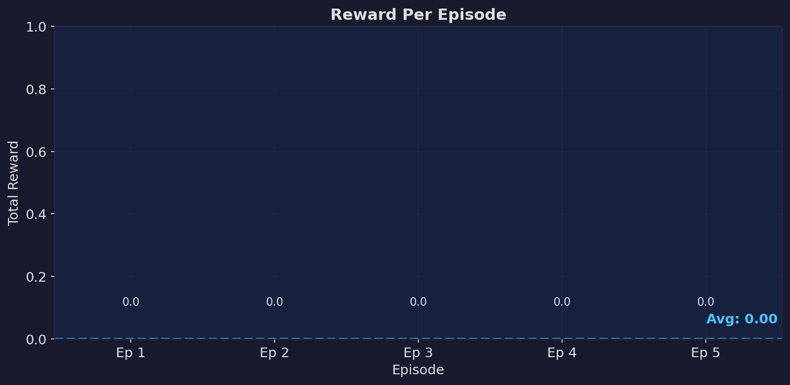

# Robot Sim

Run open source robot foundation models in simulation. Train policies, watch them improve with data.

## What This Does

Runs and trains **ACT (Action Chunking with Transformers)** policies in a MuJoCo simulation of the [ALOHA bimanual robot](https://tonyzhaozh.github.io/aloha/), performing a cube transfer task. Includes:

- **Pretrained baseline**: Run a pretrained policy (~83% success on cube transfer)
- **Training from scratch**: Train your own ACT policy on 50 human demonstrations
- **Evaluation**: Compare trained checkpoints against the pretrained baseline

## Quick Start

### Prerequisites

- macOS (Apple Silicon) or Linux
- Python 3.10
- [uv](https://docs.astral.sh/uv/) (recommended) or pip

### Setup

```bash
# Clone this repo
git clone git@github.com:AviZurlo/robot-sim.git
cd robot-sim

# Create virtual environment with Python 3.10
uv venv .venv --python 3.10
source .venv/bin/activate

# Clone and install LeRobot with MuJoCo/Aloha simulation support
git clone https://github.com/huggingface/lerobot.git
uv pip install -e "lerobot[aloha]"
```

### Run Simulation

```bash
# Run 3 episodes with the pretrained ACT policy (default)
python scripts/run_sim.py

# Customize the run
python scripts/run_sim.py --n-episodes 5 --device mps
python scripts/run_sim.py --policy lerobot/act_aloha_sim_insertion_human --task AlohaInsertion-v0
```

Videos are saved to `outputs/videos/` along with `eval_metrics.json`.

### CLI Options

| Flag | Default | Description |
|------|---------|-------------|
| `--policy` | `lerobot/act_aloha_sim_transfer_cube_human` | HuggingFace model ID |
| `--task` | `AlohaTransferCube-v0` | Gymnasium environment task |
| `--n-episodes` | `3` | Number of episodes to run |
| `--device` | `cpu` | Compute device: `cpu`, `mps`, or `cuda` |
| `--output-dir` | `outputs/videos` | Video output directory |
| `--seed` | `1000` | Starting random seed |

## Train a Custom Policy

Train an ACT policy from scratch on 50 human demonstrations from the [aloha_sim_transfer_cube_human](https://huggingface.co/datasets/lerobot/aloha_sim_transfer_cube_human) dataset.

### Training

```bash
# Quick test (~2 min on MPS)
python scripts/train.py --steps 100 --device mps

# Short run (~15 min on MPS, loss drops significantly)
python scripts/train.py --steps 1000 --device mps

# Full run (~60 min on MPS, enough to see real learning)
python scripts/train.py --steps 5000 --device mps

# Resume from last checkpoint
python scripts/train.py --steps 5000 --device mps --resume
```

Checkpoints are saved to `outputs/train/act_transfer_cube/` with a loss history log.

#### Training Options

| Flag | Default | Description |
|------|---------|-------------|
| `--steps` | `5000` | Total training steps |
| `--batch-size` | `8` | Training batch size |
| `--lr` | `1e-5` | Learning rate |
| `--device` | `cpu` | Compute device: `cpu`, `mps`, or `cuda` |
| `--output-dir` | `outputs/train/act_transfer_cube` | Checkpoint directory |
| `--log-freq` | `50` | Log every N steps |
| `--save-freq` | `1000` | Save checkpoint every N steps |
| `--resume` | - | Resume from last checkpoint |

### Evaluation

Evaluate a trained checkpoint and compare against the pretrained baseline:

```bash
# Evaluate your trained policy
python scripts/evaluate.py --checkpoint outputs/train/act_transfer_cube/last --device mps

# Evaluate pretrained baseline for comparison
python scripts/evaluate.py --checkpoint lerobot/act_aloha_sim_transfer_cube_human --device mps

# Customize
python scripts/evaluate.py --checkpoint outputs/train/act_transfer_cube/last \
    --n-episodes 10 --device mps
```

Videos and metrics are saved to `outputs/eval/`.

#### Evaluation Options

| Flag | Default | Description |
|------|---------|-------------|
| `--checkpoint` | (required) | Local checkpoint path or HuggingFace model ID |
| `--n-episodes` | `10` | Number of evaluation episodes |
| `--device` | `cpu` | Compute device |
| `--task` | `AlohaTransferCube-v0` | Environment task |
| `--output-dir` | `outputs/eval/<name>` | Output directory |

### Results Dashboard

Training loss drops rapidly from ~101 to ~2.7 over 500 steps, showing the model is learning action patterns. The pretrained baseline (100k steps) achieves 80% success; our 500-step model hasn't converged yet but the loss curve shows clear progress.

#### Training Loss



#### Trained vs Pretrained Baseline



#### Evaluation Results

| Metric | Ours (500 steps) | Pretrained (100k steps) |
|--------|----------------:|------------------------:|
| Success Rate | 0% | 80% |
| Avg Reward | 0.00 | 179.80 |
| Training Time | 5 min | ~60+ min |





### Generate Plots

```bash
# Generate all visualization plots from existing data
python scripts/visualize.py

# Full experiment: train → evaluate → plot (one command)
python scripts/run_experiment.py --steps 500 --n-episodes 5 --device mps

# Full experiment with pretrained baseline comparison
python scripts/run_experiment.py --steps 5000 --n-episodes 10 --device mps --baseline
```

#### Visualize Options

| Flag | Default | Description |
|------|---------|-------------|
| `--train-log` | `outputs/train/act_transfer_cube/loss_history.json` | Training loss log |
| `--eval-metrics` | `outputs/eval/last/eval_metrics.json` | Evaluation metrics |
| `--baseline-metrics` | `outputs/eval/lerobot_act_aloha_sim_transfer_cube_human/eval_metrics.json` | Baseline metrics |
| `--output-dir` | `outputs/plots` | Plot output directory |

#### Experiment Runner Options

| Flag | Default | Description |
|------|---------|-------------|
| `--steps` | `5000` | Training steps |
| `--n-episodes` | `10` | Evaluation episodes |
| `--device` | `cpu` | Compute device |
| `--baseline` | - | Also evaluate pretrained baseline |
| `--skip-train` | - | Skip training, only evaluate + plot |
| `--skip-eval` | - | Skip evaluation, only plot |

### Training Details

Training an ACT policy from scratch on this task:

- **Loss**: Drops from ~100 to ~0.20 over 5000 steps (L1 action loss + KL divergence)
- **Dataset**: 50 human demonstrations, 20,000 frames at 50 FPS
- **Time**: ~60 min on Apple Silicon MPS for 5000 steps

The pretrained model on HuggingFace was trained for 100,000 steps. With 5,000 steps you get a policy that has learned basic movement patterns but hasn't converged to full task success yet.

## Architecture

- **Framework:** [LeRobot](https://github.com/huggingface/lerobot) v0.4.4 (Hugging Face)
- **Simulation:** [MuJoCo](https://mujoco.org/) 3.5 via [gym-aloha](https://github.com/huggingface/gym-aloha)
- **Policy:** ACT (Action Chunking with Transformers) - 51M params
- **Environment:** `AlohaTransferCube-v0` - bimanual robot transfers a cube between grippers
- **Observation:** RGB camera (480x640) + 14-DOF joint positions
- **Action space:** 14-DOF continuous (7 per arm)

## Available Pretrained Models

| Model | Task | Environment |
|-------|------|-------------|
| `lerobot/act_aloha_sim_transfer_cube_human` | Cube transfer | `AlohaTransferCube-v0` |
| `lerobot/act_aloha_sim_insertion_human` | Peg insertion | `AlohaInsertion-v0` |

## Project Structure

```
.
├── scripts/
│   ├── run_sim.py          # Run pretrained policy in sim
│   ├── train.py            # Train ACT policy from scratch
│   ├── evaluate.py         # Evaluate trained checkpoints
│   ├── visualize.py        # Generate plots from training/eval data
│   └── run_experiment.py   # Chain: train → evaluate → visualize
├── lerobot/                 # LeRobot source (git-ignored, cloned during setup)
├── outputs/
│   ├── plots/               # Visualization PNGs (tracked in git)
│   ├── train/               # Training checkpoints and loss logs (git-ignored)
│   ├── eval/                # Evaluation videos and metrics (git-ignored)
│   └── videos/              # Pretrained policy videos (git-ignored)
├── PROJECT.md               # Project roadmap and log
├── pyproject.toml           # Python project metadata
└── README.md
```
