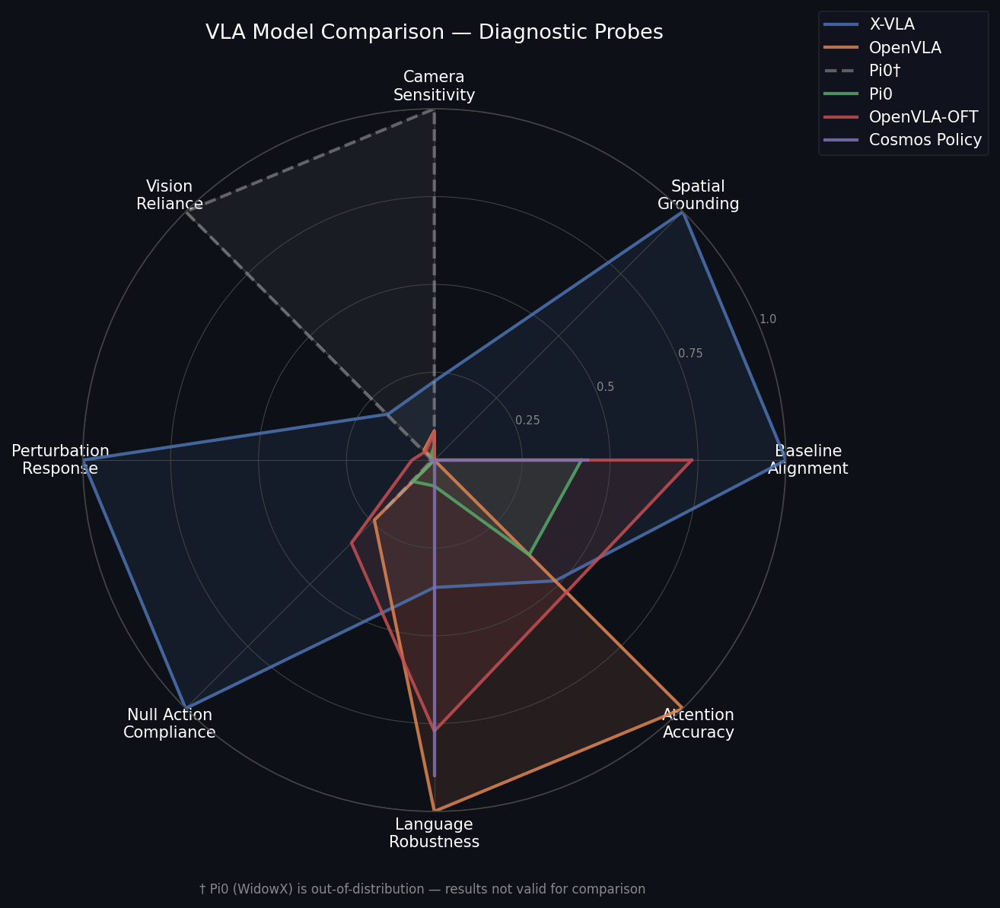
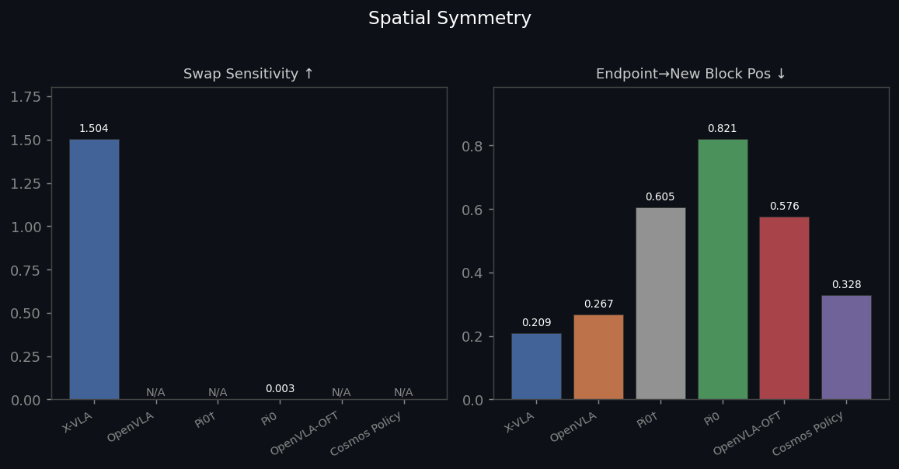
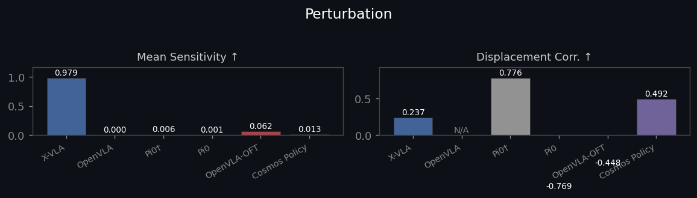
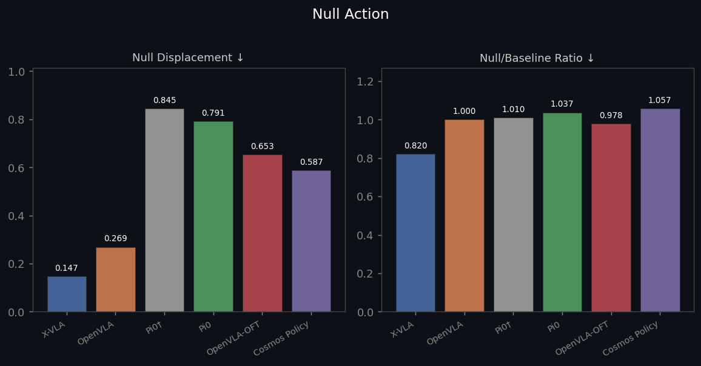
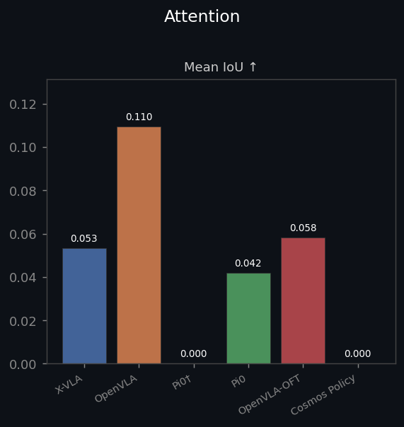
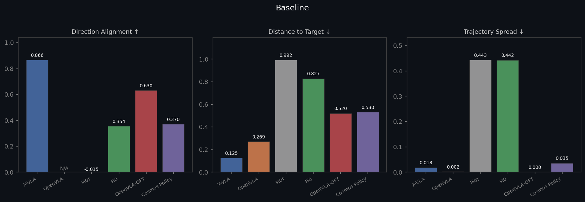
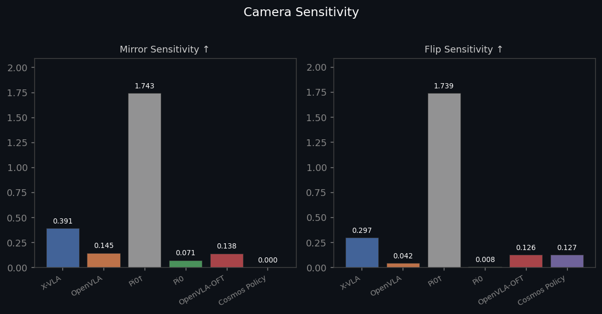
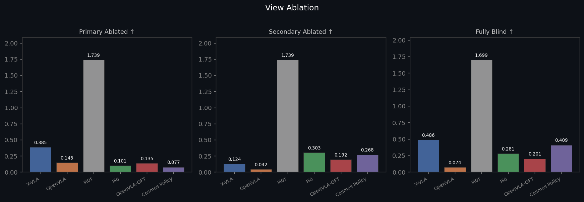
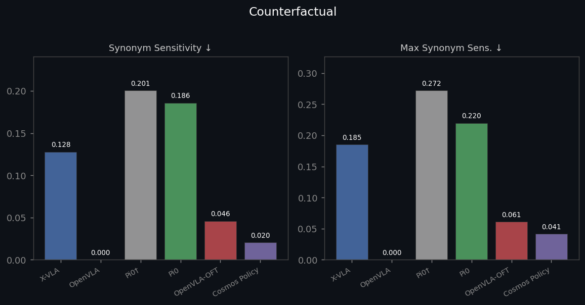

# What do VLA robots actually understand?

We ran 5 open-source [vision-language-action](https://huggingface.co/blog/lerobot-vision-language-action) models through 8 diagnostic probes in MuJoCo simulation. The probes isolate specific capabilities — spatial grounding, camera sensitivity, language understanding, out-of-distribution adaptation — by systematically perturbing the scene or instruction and measuring how the model responds.

Inspired by [Avik De's probing framework](https://www.avikde.me/p/debugging-as-architecture-insight) for X-VLA.



---

## Findings

### Only one model actually tracks where things are

When we swap the positions of the red and blue blocks mid-experiment and ask the model to "pick up the red block," only **X-VLA** re-routes to the new location (swap sensitivity: **1.50**; all others: ≤0.003). It's the only model whose trajectory endpoint lands near the red block after the swap (0.21m vs 0.27–0.82m for others).

The perturbation probe confirms this: move the block left, right, forward, back, or up — X-VLA's trajectory shifts in response (mean sensitivity: 0.979). Every other model's trajectory barely changes (≤0.062).




### OpenVLA is running a memorized motion

OpenVLA's perturbation sensitivity is exactly **0.000** — the block can move anywhere and the predicted trajectory is unchanged. Its synonym sensitivity is also exactly 0.000 — every rephrasing of "pick up the red block" produces bit-for-bit identical output. Its null/baseline ratio is exactly 1.000 — "don't move" produces the same motion as "pick up the block."

This pattern points to a model that learned to map its training distribution's most common input configuration to a fixed motion sequence, with language and vision serving as a task selector rather than a continuous scene-conditioning signal.

### No model understands "don't move"

Every model fails the null action test. When given prompts like "don't move," "stay still," or "hold position," all models continue producing significant arm motion. The null/baseline ratio — how much motion "don't move" produces relative to "pick up the block" — ranges from **0.82 (X-VLA)** to **1.06 (Cosmos Policy)**. Cosmos actually moves *more* when told to stay still.

This is a training data issue: all of these models were trained on successful task demonstrations, so null instructions have essentially no representation in their training sets.



### Models that respond to perturbation don't respond proportionally

X-VLA responds strongly to block movement (high sensitivity) but its sensitivity–displacement correlation is only **0.24** — it doesn't scale its response proportionally with how far the block moved. Pi0 (Franka) and OpenVLA-OFT show *negative* correlations (−0.77 and −0.45): larger perturbations produce *smaller* trajectory changes, which is the signature of out-of-distribution collapse.

### Attention maps don't land on objects

Mean attention IoU across all models is near zero. Even the best result — OpenVLA at **0.11** — indicates the model's spatial attention is largely diffuse across the image rather than localized to task-relevant objects. The attention mechanism in these VLMs does not appear to be doing pixel-precise object grounding.



---

## Full Results

<!-- RESULTS_START -->
| Metric | X-VLA<br>(WidowX) | OpenVLA<br>(WidowX) | Pi0 (OOD)<br>(WidowX) | Pi0<br>(Franka) | OpenVLA-OFT<br>(Franka) | Cosmos Policy<br>(Franka) |
| :--- | :---: | :---: | :---: | :---: | :---: | :---: |
| **Baseline** | | | | | | |
| Direction Alignment ↑ | 0.866 | N/A | -0.015 | 0.354 | 0.630 | 0.370 |
| Distance to Target ↓ | 0.125 | 0.269 | 0.992 | 0.827 | 0.520 | 0.530 |
| Trajectory Spread ↓ | 0.018 | 0.002 | 0.443 | 0.442 | 0.000 | 0.035 |
| **Spatial Symmetry** | | | | | | |
| Swap Sensitivity ↑ | **1.504** | N/A | N/A | 0.003 | N/A | N/A |
| Endpoint→New Block Pos ↓ | **0.209** | 0.267 | 0.605 | 0.821 | 0.576 | 0.328 |
| **Camera Sensitivity** | | | | | | |
| Mirror Sensitivity ↑ | 0.391 | 0.145 | 1.743† | 0.071 | 0.138 | 0.000 |
| Flip Sensitivity ↑ | 0.297 | 0.042 | 1.739† | 0.008 | 0.126 | 0.127 |
| **View Ablation** | | | | | | |
| Primary Ablated ↑ | 0.385 | 0.145 | 1.739† | 0.101 | 0.135 | 0.077 |
| Secondary Ablated ↑ | 0.124 | 0.042 | 1.739† | 0.303 | 0.192 | 0.268 |
| Fully Blind ↑ | 0.486 | 0.074 | 1.699† | 0.281 | 0.201 | 0.409 |
| **Counterfactual** | | | | | | |
| Synonym Sensitivity ↓ | 0.128 | **0.000** | 0.201 | 0.186 | 0.046 | 0.020 |
| Max Synonym Sens. ↓ | 0.185 | **0.000** | 0.272 | 0.220 | 0.061 | 0.041 |
| **Null Action** | | | | | | |
| Null Displacement ↓ | 0.147 | 0.269 | 0.845 | 0.791 | 0.653 | 0.587 |
| Null/Baseline Ratio ↓ | **0.820** | 1.000 | 1.010 | 1.037 | 0.978 | 1.057 |
| **Perturbation** | | | | | | |
| Mean Sensitivity ↑ | **0.979** | 0.000 | 0.006 | 0.001 | 0.062 | 0.013 |
| Displacement Corr. ↑ | 0.237 | N/A | 0.776† | -0.769 | -0.448 | 0.492 |
| **Attention** | | | | | | |
| Mean IoU ↑ | 0.053 | 0.110 | 0.000 | 0.042 | 0.058 | 0.000 |

↑ higher is better · ↓ lower is better · N/A = not available · OOD = out-of-distribution (Pi0 trained on Franka, tested on WidowX) · † inflated by stochasticity (spread=0.44)
<!-- RESULTS_END -->

---

## Per-Probe Charts

| | |
|:---:|:---:|
|  |  |
|  |  |
|  |  |
|  |  |

---

## Probes

| # | Probe | What it tests |
|---|---|---|
| 1 | **Baseline** | Does the arm reach the correct object? Measures direction alignment and output consistency across seeds. |
| 2 | **Spatial Symmetry** | Does it track where objects are, or always move to the same place? Swaps block positions with the same instruction. |
| 3 | **Camera Sensitivity** | Is it actually using the image? Shifts the camera 0.3m laterally and measures output change. |
| 4 | **View Ablation** | Which camera does it depend on? Blacks out each view independently and measures the impact. |
| 5 | **Counterfactual** | Does it understand language or just match tokens? Tests synonym phrasings of the same task. |
| 6 | **Null Action** | Does "don't move" produce less motion than "pick up the block"? |
| 7 | **Attention** | When it sees "red block," does attention land on the red block? Measures heatmap–object IoU. |
| 8 | **Perturbation** | Does the trajectory adapt when the block moves? Tests whether sensitivity scales with displacement. |

## Models

| Model | Scene | Device |
|---|---|---|
| [X-VLA](https://github.com/TrossenRobotics/x-vla) | WidowX | Apple MPS |
| [OpenVLA](https://github.com/openvla/openvla) | WidowX | Apple MPS |
| [Pi0](https://github.com/Physical-Intelligence/openpi) | Franka | Apple MPS |
| [OpenVLA-OFT](https://github.com/openvla/openvla-oft) | Franka | Apple MPS |
| [Cosmos Policy](https://github.com/nvlabs/cosmos-policy) | Franka | CUDA (RunPod A40) |

## Reproduce

```bash
git clone https://github.com/AviZurlo/robot-sim.git
cd robot-sim
uv venv .venv --python 3.12 && source .venv/bin/activate
uv pip install -e ".[xvla]"   # swap for: openvla, pi0, openvla-oft

# Run all 8 probes
python -m vla_probing.run_all --model xvla --scene widowx --device mps

# Interactive sim viewer
.venv/bin/mjpython scripts/run_sim_interactive.py --scene widowx --model xvla

# Streamlit dashboard
bash scripts/start_probe_dashboard.sh   # → http://localhost:8502

# Regenerate README figures and table
python scripts/generate_results.py
```

For Cosmos Policy on RunPod: `bash scripts/run_cosmos_cloud.sh`
